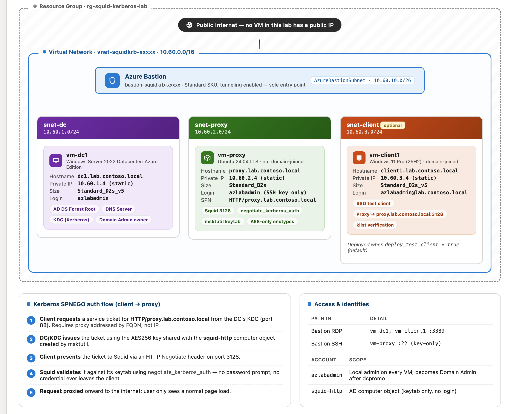

# Quick Start

### What is included in this lab?




### Prerequisites

* Azure subscription
* Azure CLI installed and logged in
* Terraform installed

### Flow

```shell

# logged in to Azure CLI and Terraform installed?
az account show -o table
terraform -version

# deploy
time make up

# access proxy vm via bastion
SSH_KEY=~/.ssh/your_key make ssh-proxy
# access RDP to client vm via bastion - tunnel RDP port 3389 to local port 33388
LOCAL_RDP_PORT=33388 make rdp-client
```